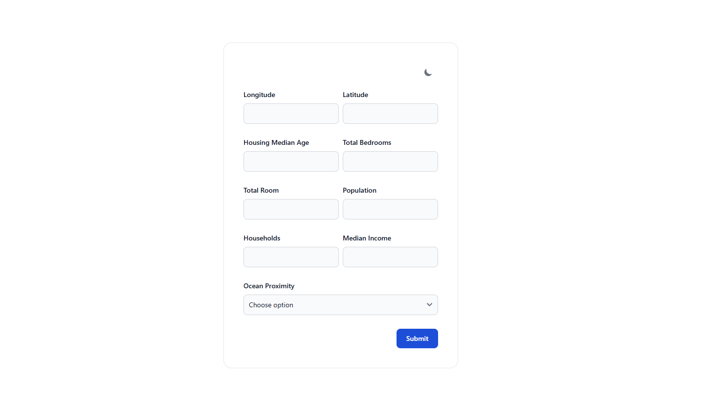

# Flask Model Prediction

Flask Model Prediction app is one of my personal project to integrate web development skill combine with machine learning skill. In this project, there is a form that you can fill the input and then getting prediction response.

# About This Project
This project is about California Housing Price Prediction. There are 9 features we need to fill in the form to get prediction. The prediction is the price of house in the given location.



## Installation

Use the package manager [pip](https://pip.pypa.io/en/stable/).

```bash
#Install Flask and requirements
pip install Flask
pip install requirements.txt

#Install Tailwind and Flowbite
npm install tailwindcss @tailwindcss/cli --save-dev
npm install flowbite --save
```

## Usage

```python
#Run Flask
flask app.py

#Run CSS
npx @tailwindcss/cli -i ./static/src/input.css -o ./static/dist/output.css --watch
```

## Contributing

Pull requests are welcome. For major changes, please open an issue first
to discuss what you would like to change.

Please make sure to update tests as appropriate.

## License

[MIT](https://choosealicense.com/licenses/mit/)